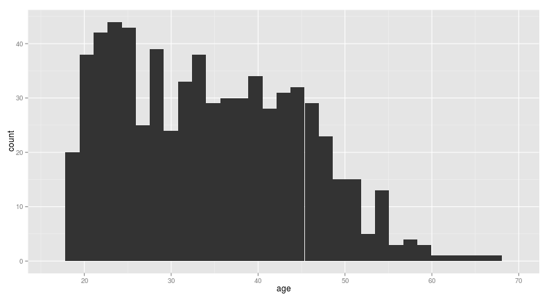
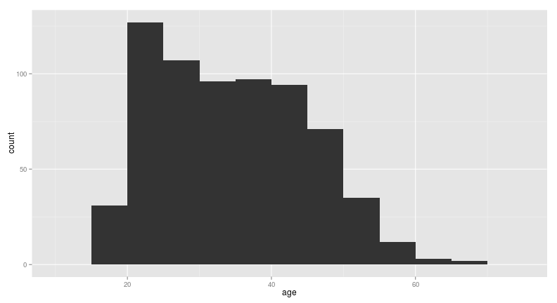
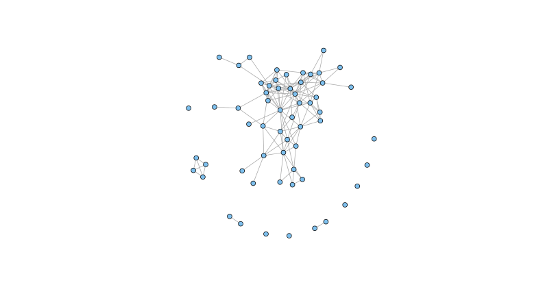
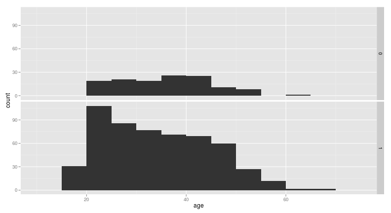
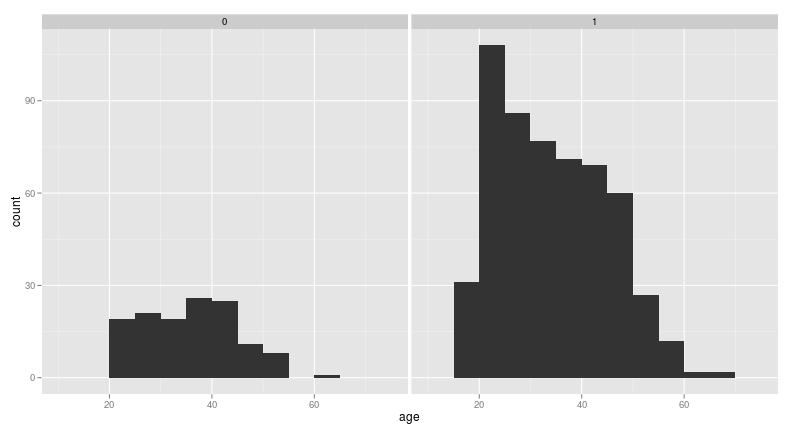
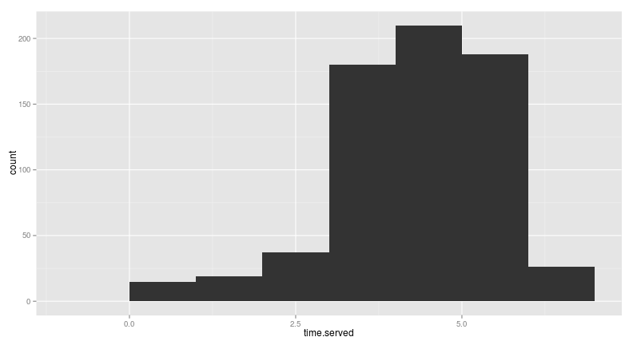
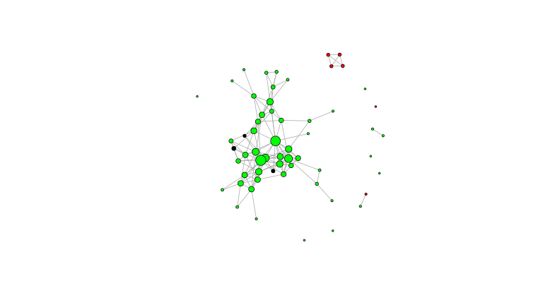

# VISUALIZING ATTRIBUTES OF PAROLE VIOLATORS
========================================================

```r
require(ggplot2)
```

```
## Loading required package: ggplot2
```

In the crime lecture, we saw how we can use heatmaps to give a 2-dimensional representation of 3-dimensional data: we made heatmaps of crime counts by time of the day and day of the week. In this problem, we'll learn how to use histograms to show counts by one variable, and then how to visualize 3 dimensions by creating multiple histograms.

We'll use the parole data [parole.csv](https://courses.edx.org/c4x/MITx/15.071x/asset/parole.csv) from Week 3. Before, we used this data to predict parole violators. Now, let's try to get a little more insight into this dataset using histograms. As a reminder, the variables in this dataset are:

* __male__ = 1 if the parolee is male, 0 if female
* __race__ = 1 if the parolee is white, 2 otherwise

* __age__ = the parolee's age in years at the time of release from prison

* __state__ = a code for the parolee's state. 2 is Kentucky, 3 is Louisiana, 4 is Virginia, and 1 is any other state. These three states were selected due to having a high representation in the dataset.

* __time.served__ = the number of months the parolee served in prison (limited by the inclusion criteria to not exceed 6 months).

* __max.sentence__ = the maximum sentence length for all charges, in months (limited by the inclusion criteria to not exceed 18 months).

* __multiple.offenses__ = 1 if the parolee was incarcerated for multiple offenses, 0 otherwise.

* __crime__ = a code for the parolee's main crime leading to incarceration. 2 is larceny, 3 is drug-related crime, 4 is driving-related crime, and 1 is any other crime.

* __violator__ = 1 if the parolee violated the parole, and 0 if the parolee completed the parole without violation.

========================================================
## PROBLEM 1.1 - LOADING THE DATA  (1 point possible)
Using the read.csv function, load the dataset parole.csv and call it parole. Since male, state, and crime are all unordered factors, convert them to factor variables using the following commands:


```r
parole = read.csv("parole.csv")
parole$male = as.factor(parole$male)

parole$state = as.factor(parole$state)

parole$crime = as.factor(parole$crime)
```


What fraction of parole violators are female?

```r
x = parole[parole$violator == 1, ]
sum(2 - as.numeric(x$male))/length(x$male)
```

```
## [1] 0.1795
```


## PROBLEM 1.2 - LOADING THE DATA  (1 point possible)
In this dataset, which crime is the most common in Kentucky?

```r
x = table(parole$crime[parole$state == 2])
names(x) = c("other", "larceny", "drug", "driving")
x
```

```
##   other larceny    drug driving 
##      42      10      64       4
```


========================================================
## PROBLEM 2.1 - CREATING A BASIC HISTOGRAM  (1 point possible)
Recall from lecture that in `ggplot`, we need to specify the dataset, the aesthetic, and the geometry. To create a histogram, the geometry will be `geom_histogram`. The data we'll use is `parole`, and the aesthetic will be the map from a variable to the x-axis of the histogram.

Create a histogram to find out the distribution of the age of parolees, by typing the following command in your R console:


```r
ggplot(data = parole, aes(x = age)) + geom_histogram()
```

```
## stat_bin: binwidth defaulted to range/30. Use 'binwidth = x' to adjust this.
```

 


By default, `geom_histogram` divides the data into 30 bins. Change the width of the bins to 5 years by adding the argument `binwidth = 5` to `geom_histogram`.

```r
ggplot(data = parole, aes(x = age)) + geom_histogram(binwidth = 5)
```

 


Note that by default, histograms create bins where the left endpoint is included in the bin, but the right endpoint isn't. So the first bin in this histogram represents parolees who are between 15 and 19 years old. The last bin in this histogram represents parolees who are between 65 and 69 years old.

What is the age bracket with the most parolees?
**20 -- 24**

## PROBLEM 2.2 - CREATING A BASIC HISTOGRAM  (1 point possible)
Redo the histogram, adding the following argument to the geom_histogram function: color="blue". What does this do? Select all that apply.

```r
ggplot(data = parole, aes(x = age)) + geom_histogram(binwidth = 5, color = "blue")
```

 

**Changes the outline color of the bars**

========================================================
## PROBLEM 3.1 - ADDING ANOTHER DIMENSION  (1 point possible)
Now suppose we are interested in seeing how the age distribution of male parolees compares to the age distribution of female parolees.

One option would be to create a heatmap with age on one axis and male (a binary variable in our data set) on the other axis. Another option would be to stick with histograms, but to create a separate histogram for each gender. ggplot has the ability to do this automatically using the facet_grid command.

To create separate histograms for male and female, type the following command into your R console:


```r
ggplot(data = parole, aes(x = age)) + geom_histogram(binwidth = 5) + facet_grid(male ~ 
    .)
```

 


The histogram for female parolees is shown at the top, and the histogram for male parolees is shown at the bottom.

What is the age bracket with the most female parolees?
**35 -- 39**

## PROBLEM 3.2 - ADDING ANOTHER DIMENSION  (1 point possible)
Now change the facet_grid argument to be ".~male" instead of "male~.". What does this do?

```r
ggplot(data = parole, aes(x = age)) + geom_histogram(binwidth = 5) + facet_grid(. ~ 
    male)
```

 

**Puts the histograms side-by-side instead of on top of each other.**

## PROBLEM 3.3 - ADDING ANOTHER DIMENSION  (1 point possible)
An alternative to faceting is to simply color the different groups differently. To color the data points by group, we need to tell ggplot that a property of the data (male or not male) should be translated to an aesthetic property of the histogram. We can do this by setting the fill parameter within the aesthetic to male.

Run the following command in your R console to produce a histogram where data points are colored by group:


```r
ggplot(data = parole, aes(x = age, fill = male)) + geom_histogram(binwidth = 5)
```

 


Since we didn't specify colors to use, ggplot will use its default color selection. What color is the histogram for the female parolees?
**salmon**

## PROBLEM 3.4 - ADDING ANOTHER DIMENSION  (1 point possible)
Coloring the groups differently is a good way to see the breakdown of age by sex within the single, aggregated histogram. However, the bars here are stacked, meaning that the height of the blue/teal bars in each age bin represents the total number of parolees in that age bin, not just the number of parolees in that group.

An alternative to a single, stacked histogram is to create two histograms and overlay them on top of each other. This is a simple adjustment to our previous command.

We just need to:

1) Tell ggplot not to stack the histograms by adding the argument `position="identity"` to the geom_histogram function.

2) Make the bars semi-transparent so we can see both colors by adding the argument alpha=0.5 to the geom_histogram function.

Redo the plot, making both of these changes.

```r
ggplot(data = parole, aes(x = age, fill = male)) + geom_histogram(binwidth = 5, 
    position = "identity", alpha = 0.5)
```

 


Which of the following buckets contain no female paroles?
**15 -- 19, 55 -- 59, 65 -- 69**

========================================================
## PROBLEM 4.1 - TIME SERVED  (1 point possible)
Now let's explore another aspect of the data: the amount of time served by parolees. Create a basic histogram like the one we created in Problem 2, but this time with time.served on the x-axis. Set the bin width to one month.

What is the most common length of time served, according to this histogram?

```r
ggplot(data = parole, aes(x = time.served)) + geom_histogram(binwidth = 1)
```

 

**between 4 and 5 months**

## PROBLEM 4.2 - TIME SERVED  (1 point possible)
Change the binwidth to 0.1 months. Now what is the most common length of time served, according to the histogram?

```r
ggplot(data = parole, aes(x = time.served)) + geom_histogram(binwidth = 0.1)
```

 

**Between 3.0 and 3.1 months**
*Be careful when choosing the binwidth - it can significantly affect the interpretation of a histogram! When visualizing histograms, it is always a good idea to vary the bin size in order to understand the data at various granularities.*

## PROBLEM 4.3 - TIME SERVED  (2 points possible)
Now, suppose we suspect that it is unlikely that each type of crime has the same distribution of time served. To visualize this, change the binwidth back to 1 month, and use `facet_grid` to create a separate histogram of time.served for each value of the variable crime.

```r
xx = parole
levels(xx$crime) = c("other", "larceny", "drugs", "driving")
ggplot(data = xx, aes(x = time.served)) + geom_histogram(binwidth = 1) + facet_grid(facets = . ~ 
    crime)
```

 


Which crime type has no observations where time served is less than one month? Recall that crime type #2 is larceny, #3 is drug-related crime, #4 is driving-related crime, and #1 is any other crime.
**Driving-related**

For which crime does the frequency of 5-6 month prison terms exceed the frequencies of each other term length?
**Drug-related**

## PROBLEM 4.4 - TIME SERVED  (1 point possible)
Now, instead of faceting the histograms, overlay them. Remember to set the position and alpha parameters so that the histograms are not stacked. Also, make sure to indicate that the fill aesthetic should be "crime".


```r
xx = parole
levels(xx$crime) = c("other", "larceny", "drugs", "driving")
ggplot(data = xx, aes(x = time.served, fill = crime)) + geom_histogram(binwidth = 1, 
    position = "identity", alpha = 0.5) + scale_x_continuous(breaks = 0:7)
```

 


In this case, faceting seems like a better alternative. Why?
**With four different groups, it can be hard to tell them apart when they are overlayed.**
